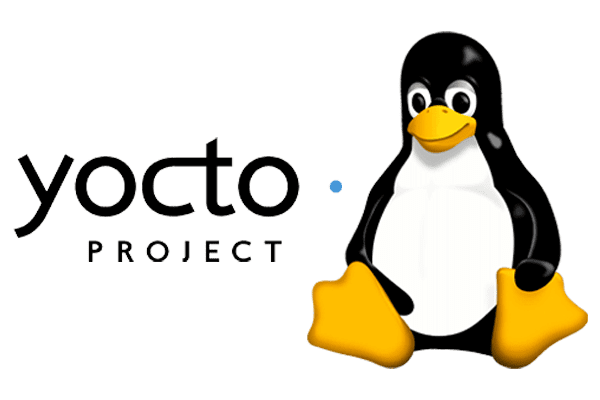

# Development of Image Accelerator and Interfacing with Linux Kernel Module in a Custom Yocto Image

  
  
  

## Project Overview
This project involves developing a custom hardware image accelerator and integrating it into a QEMU virtual board environment. The hardware will be interfaced with a Linux Kernel Module (LKM) and run within
 a custom-built image generated using the Yocto Project.

## Objective
The goal is to create a seamless pipeline where:

- The userspace application interacts with the virtual hardware.
- Data is sent from the userspace application to the image accelerator for processing.
- The processed image data is sent back to the userspace application for display or further use.

## Key Components
- Custom Hardware: A virtual hardware accelerator for image processing.
- QEMU Virtual Environment: Simulated hardware environment for development and testing.
- Linux Kernel Module (LKM): Serves as the interface between the custom hardware and the Linux operating system.
- Yocto Project: Used to build a minimal and tailored Linux image containing the necessary drivers and applications.
- Userspace Application: Acts as the front-end for sending image data to the hardware and displaying the processed output.